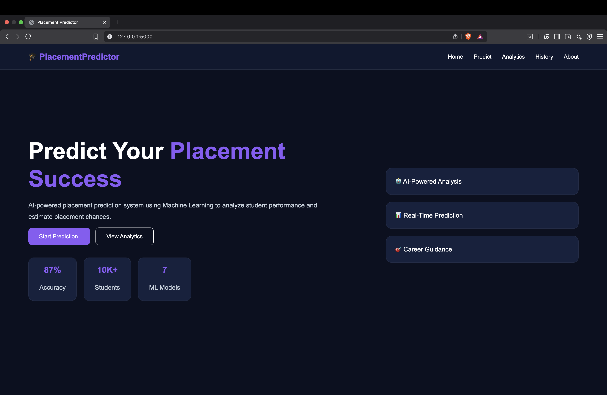
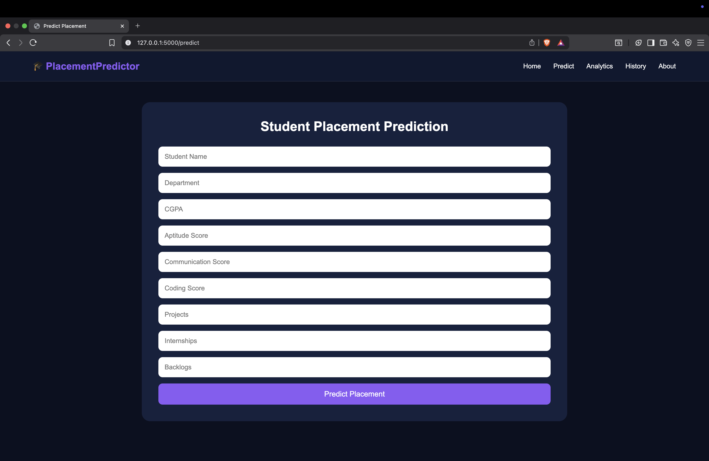
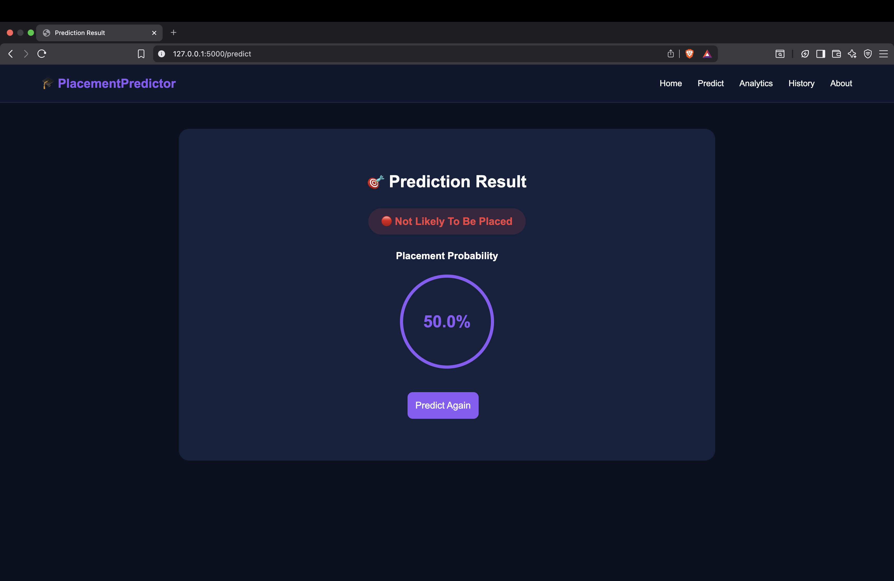
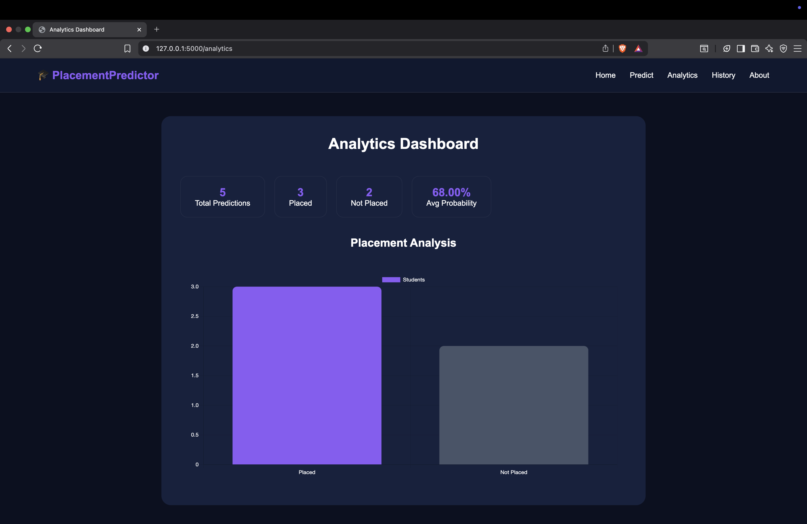
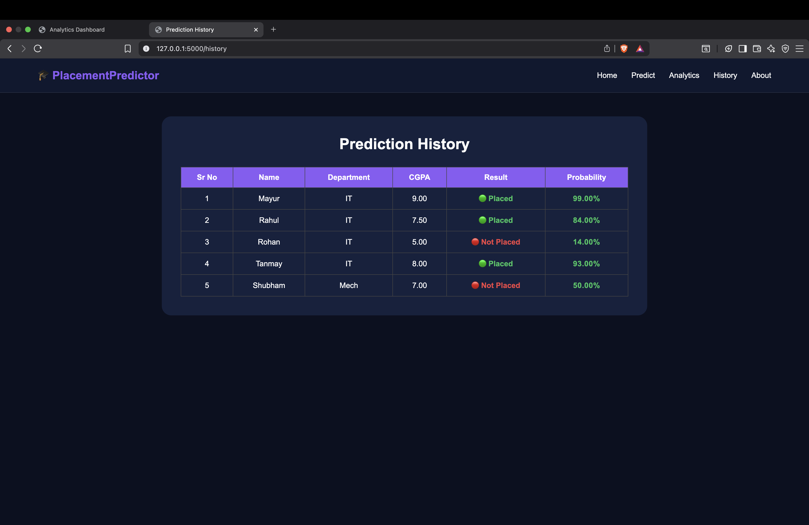
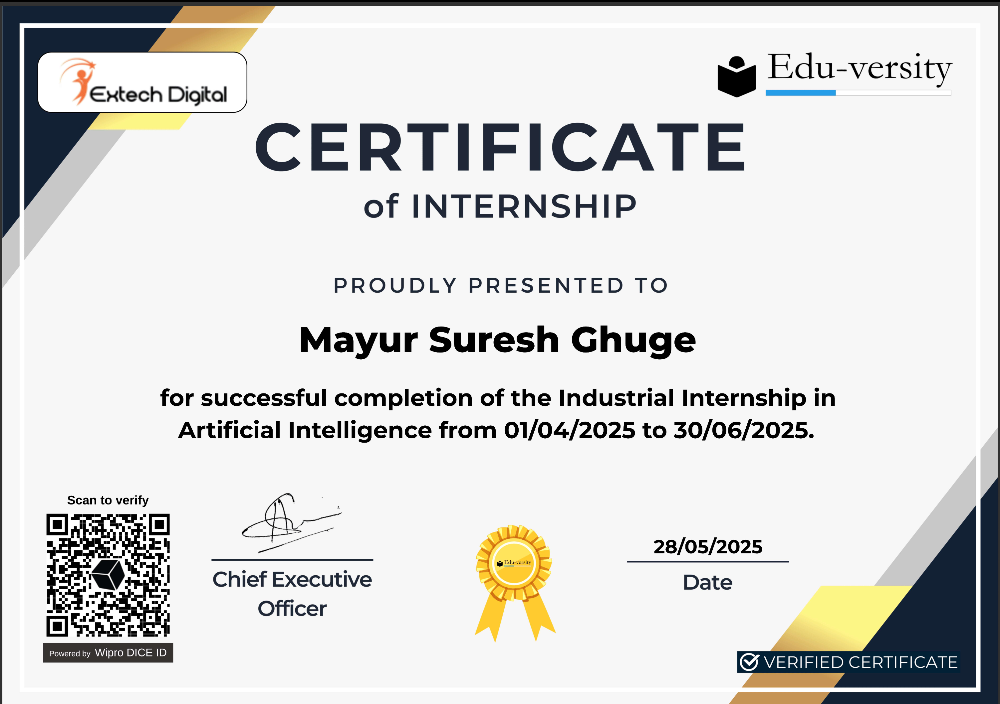

# 🎓 Student Placement Prediction System

An AI-powered web application that predicts a student's placement chances using Machine Learning.

## 🚀 Features

- Placement Prediction
- Prediction Probability Score
- Analytics Dashboard
- Prediction History
- MySQL Database Integration
- Responsive UI

## 🛠️ Tech Stack

- Python
- Flask
- MySQL
- Scikit-Learn
- HTML
- CSS
- JavaScript

## 📊 Input Parameters

- CGPA
- Aptitude Score
- Communication Score
- Coding Score
- Projects
- Internships
- Backlogs

## 📸 Screenshots

### Home Page

### Prediction Form

### Prediction Result

### Analytics Dashboard

### Prediction History

## ▶️ Run Project

bash
pip install -r requirements.txt
python app.py

Open:

http://127.0.0.1:5000

## 🏆 Internship

Developed as part of my Artificial Intelligence Internship at Extech Digital & Edu-versity (Apr 2025 – Jun 2025), focusing on Machine Learning, Flask, and MySQL-based application development.
## 📜 Internship Certificate

## 👨‍💻 Developer

Mayur Ghuge**
